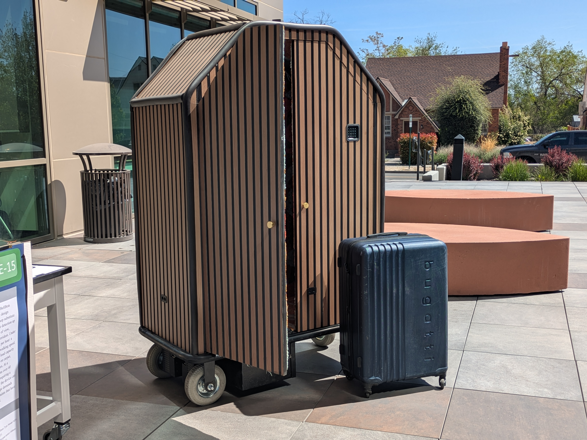

# BellBot — Autonomous Luggage Carrier

> **My role:** I designed and built the complete electronics, sensor integration, and autonomy software for this system. A team of 5 contributed the drive system and fabricated the housing.

---

## Overview

The BellBot autonomous luggage system addresses two pressing challenges in the hotel industry: guest luggage security and bell service operational cost. A guest checks in, their luggage is loaded into BellBot and secured via an electronic locking system, and the cart autonomously navigates to the guest's room, arriving ready to meet them.

With a projected unit cost of ~$2500, BellBot offers a compelling alternative to the ongoing labor cost of human bell staff.

---

## How It Works

BellBot is controlled by an Arduino running a C++ autonomy stack. At the core of the system:

- A **keypad interface** handles guest authentication and program selection
- An array of **Ultrasonic sensors** provide obstacle detection to stop the cart safely if something enters its path
- An **electronic locking mechanism** secures the luggage compartment until the correct code is entered at the destination
- A **motor controller** interfaces between the Arduino and the drive system, translating autonomy commands into wheel movement

The system is designed around a simple state machine: the cart accepts a destination program, locks the compartment, navigates autonomously, and waits for authenticated unlocking at the destination.

---

## My Contributions

All code in this repository was written by me. My work on BellBot covered three areas:

**Electronics & Wiring** — Designed and wired the complete electronics system, including the Arduino, motor controller, ultrasonic sensors, keypad, and electronic lock. Designed the electronics enclosure and produced the full system wiring diagram and bill of materials for electronic components.

**Sensor Integration** — Wrote all processing code for the ultrasonic sensor data. Tuned detection thresholds and motor control logic for reliable real-world performance in a corridor environment.

**Autonomy Stack** — Implemented the sensor data processing, keypad input handling, navigation programs, and motor control interface in C++. Designed the demo program suite for testing and demonstration purposes.

> 📂 Full portfolio write-up with circuit diagrams, wiring photos, and CAD files: [sites.google.com/view/JonathanLukeStoll](#)

---

## Demo Programs

The system ships with five navigation programs selectable via keypad at startup. These were designed to test and demonstrate the key movement capabilities of the BellBot device.

| Keystring | Program | Description |
|-----------|---------|-------------|
| `1972` | Unlock Door | Electronic lock retracts. Compartment can be locked again with any four digits which are not already a stated input code. |
| `#A11` | Stop on Detection | Cart advances until an obstacle is detected by the ultrasonic sensors, then halts |
| `#B22` | Turn Left | Executes a calibrated 90° left turn |
| `#C33` | Turn Right | Executes a calibrated 90° right turn |
| `#D44` | Turn 180 | Executes a full calibrated 180° turn |
| `BBBB` | Move Backward | Reverses for five seconds |

Enter `####` at any time to stop the current program.

---

## Hardware

| Component | Role |
|-----------|------|
| Arduino Mega | Main computer and autonomy controller |
| Ultrasonic sensors | Obstacle detection |
| Matrix keypad | Guest authentication and program selection |
| Electronic lock | Luggage compartment security |
| Motor controller | Drive system interface |

Full wiring diagram, electronics BOM, and enclosure CAD files available at the portfolio link above.

---

## Acknowledgments

BellBot was a senior capstone project completed by a team of 5 Mechanical Engineering students.

| Contributor | Role |
|-------------|------|
| Jonathan Stoll | Electronics, sensor integration, autonomy software |
| Colton Hope | Drive system design, housing fabrication |
| Tyler Swanson | 3D CAD models and design drawings, housing fabrication |
| Pedro Lechuga | Housing fabrication |
| Terrance Silva | Design document preparation and presentation of final design |

---

*University of Nevada, Reno · Mechanical Engineering Capstone · 2026*
